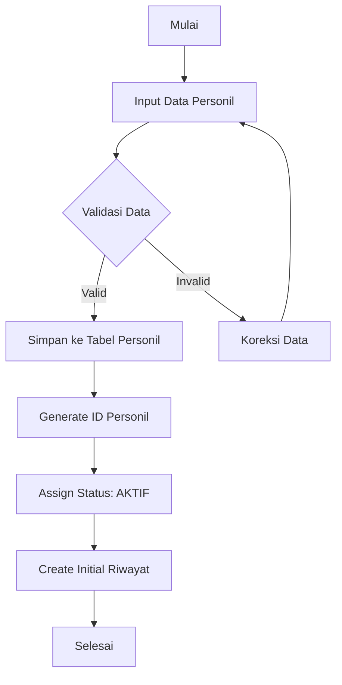
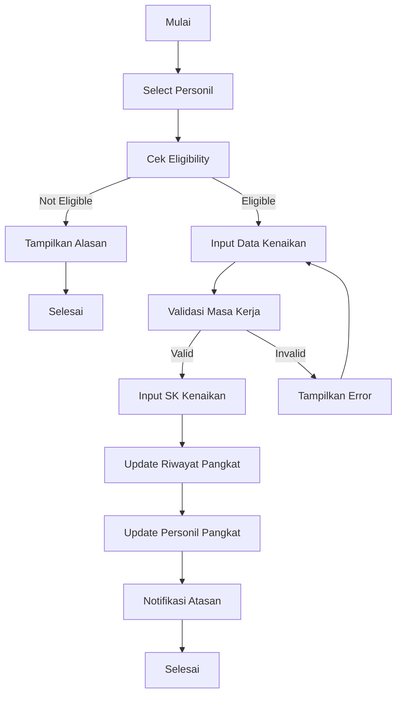
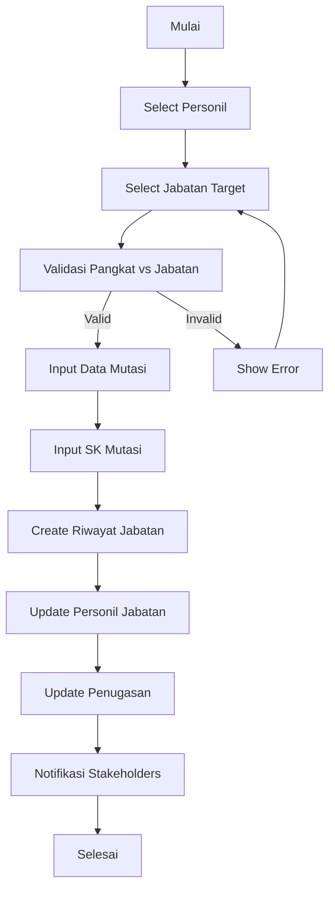
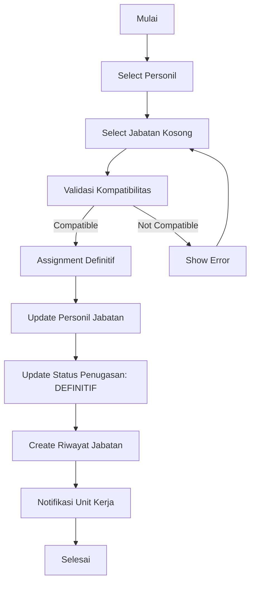
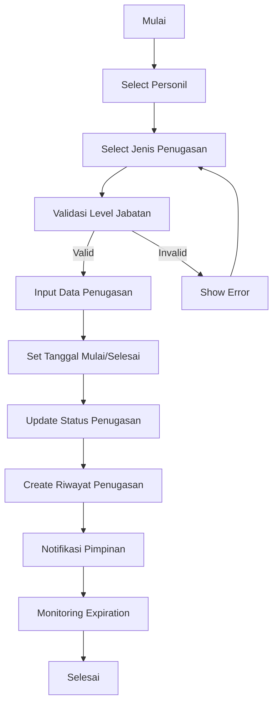

# Flow Aplikasi Manajemen Personil POLRES - Sesuai Peraturan

## 📋 **DESAIN FLOW MANAJEMEN PERSONIL POLRES**

### **🎯 Prinsip Dasar:**
1. **Personil First** - Data personil adalah foundation
2. **Penugasan Second** - Penugasan adalah assignment dari personil
3. **Compliance First** - Semua flow sesuai PERKAP dan Perpol
4. **Audit Trail** - Semua perubahan tercatat
5. **Validation** - Validasi otomatis di setiap step

---

## 🔄 **FLOW MANAJEMEN PERSONIL LENGKAP**

### **📅 Phase 1: Data Master Personil (Foundation)**

#### **Step 1.1: Registrasi Personil Baru**


**Required Fields:**
- **Data Identitas:** Nama, NRP, Tempat/Tanggal Lahir, Jenis Kelamin
- **Data Kepegawaian:** Golongan, Pangkat, Jenis Pegawai
- **Data Kontak:** Alamat, Telepon, Email
- **Data Pendidikan:** Pendidikan formal dan non-formal
- **Data Keluarga:** Status nikah, tanggungan

**Validation Rules:**
- NRP harus unique dan sesuai format POLRI
- Pangkat harus sesuai jenjang karir
- Data wajib tidak boleh kosong
- Validasi format email dan telepon

#### **Step 1.2: Update Data Personil**
```sql
-- Tabel yang terlibat:
personil (master data)
personil_kontak (kontak info)
personil_medsos (media sosial)
personil_pendidikan (pendidikan)
riwayat_alamat (riwayat alamat)
```

**Flow Update:**
1. **Select Personil** berdasarkan NRP/Nama
2. **Edit Data** dengan validasi real-time
3. **Update Master Data** di tabel personil
4. **Log Perubahan** ke audit trail
5. **Notifikasi** ke atasan jika perubahan critical

---

### **📅 Phase 2: Manajemen Kepegawaian (Career Management)**

#### **Step 2.1: Kenaikan Pangkat**


**Eligibility Check:**
- Masa kerja minimal sesuai jenjang
- Tidak ada pending disiplin
- Pendidikan sesuai requirement
- Evaluasi kinerja memenuhi syarat

#### **Step 2.2: Mutasi/Promosi Jabatan**


**Validation Rules:**
- Pangkat personil ≥ pangkat minimum jabatan
- Jabatan target tersedia (tidak diisi)
- Masa kerja cukup untuk jenjang
- Tidak ada konflik interest

---

### **📅 Phase 3: Manajemen Penugasan (Assignment Management)**

#### **Step 3.1: Assignment Jabatan Definitif**


#### **Step 3.2: Assignment Penugasan Sementara**


**Jenis Penugasan Sementara:**
- **PS (Pejabat Sementara)** - Level Eselon 3+
- **Plt (Pelaksana Tugas)** - Semua level
- **Pjs (Pejabat Sementara)** - Level Eselon 2+
- **Plh (Pelaksana Harian)** - Semua level
- **Pj (Penjabat)** - Level Eselon 3+

---

### **📅 Phase 4: Monitoring & Reporting**

#### **Step 4.1: Dashboard Personil**
```sql
-- Data yang ditampilkan:
1. Total Personil per Pangkat
2. Total Personil per Jenis Kepegawaian
3. Personil dengan Penugasan Aktif
4. Riwayat Mutasi/Promosi 6 bulan terakhir
5. Personil akan pensiun 1 tahun ke depan
6. Jabatan kosong critical
```

#### **Step 4.2: Laporan Compliance**
```sql
-- Laporan yang dihasilkan:
1. Laporan Struktur Organisasi (sesuai PERKAP)
2. Laporan Kepatuhan Pangkat vs Jabatan
3. Laporan Penugasan Sementara (PS ≤ 15%)
4. Laporan Riwayat Karir Personil
5. Laporan Evaluasi Kinerja
6. Laporan Disiplin Personil
```

---

## 🔗 **RELATIONSHIP FLOW PERSONIL vs PENUGASAN**

### **📊 Hierarki Flow:**
```
📋 PERSONIL (Foundation)
├── Data Master Personil
├── Riwayat Pendidikan
├── Riwayat Pangkat
├── Riwayat Jabatan
└── Riwayat Penugasan

🎯 PENUGASAN (Assignment)
├── Jenis Penugasan (Master)
├── Alasan Penugasan (Master)
├── Status Jabatan (Master)
├── Riwayat Penugasan
└── Monitoring Expiration
```

### **🔄 Integration Points:**
```sql
-- Personil -> Penugasan
personil.id_jabatan --> jabatan.id
personil.id_pangkat --> pangkat.id
personil.id_jenis_penugasan --> master_jenis_penugasan.id
personil.id_alasan_penugasan --> master_alasan_penugasan.id
personil.id_status_jabatan --> master_status_jabatan.id

-- Riwayat -> Personil
riwayat_jabatan.id_personil --> personil.id
riwayat_pangkat.id_personil --> personil.id
```

---

## 🎯 **VALIDATION RULES PER FASE**

### **✅ Phase 1: Personil Validation**
```sql
-- NRP Validation
- Format: 8 digit angka
- Unique: Tidak boleh duplikat
- Range: Sesuai dengan tahun masuk

-- Pangkat Validation
- Sesuai jenjang karir
- Tidak ada lompatan pangkat
- Masa kerja minimal terpenuhi

-- Data Wajib Validation
- Nama: Tidak boleh kosong
- Tempat/Tanggal Lahir: Valid
- Jenis Kelamin: L/P
- Alamat: Tidak boleh kosong
```

### **✅ Phase 2: Kepegawaian Validation**
```sql
-- Kenaikan Pangkat Validation
- Masa kerja: Sesuai jenjang
- Evaluasi: Memenuhi syarat
- Disiplin: Tidak ada pending
- Pendidikan: Sesuai requirement

-- Mutasi Jabatan Validation
- Pangkat: ≥ minimum jabatan
- Jabatan: Tidak diisi orang lain
- Kompetensi: Sesuai dengan jabatan
- Tidak ada konflik interest
```

### **✅ Phase 3: Penugasan Validation**
```sql
-- PS Validation
- Level: Eselon 3 ke atas
- Percentage: ≤ 15% total jabatan
- Duration: Maksimal 12 bulan
- SK: Wajib ada

-- Plt Validation
- Reason: Berhalangan tetap
- Duration: Sesuai alasan
- Authority: Full kewenangan
- Documentation: Lengkap

-- Pjs Validation
- Level: Eselon 2 ke atas
- Duration: Maksimal 6 bulan
- Authority: Terbatas
- SK: Wajib ada
```

---

## 📊 **DATABASE SCHEMA UNTUK FLOW PERSONIL**

### **🗄️ Enhanced Personil Table**
```sql
CREATE TABLE personil_enhanced (
    id INT PRIMARY KEY AUTO_INCREMENT,
    nrp VARCHAR(20) UNIQUE NOT NULL,
    nip VARCHAR(18),
    nama VARCHAR(255) NOT NULL,
    gelar_pendidikan TEXT,
    
    -- Data Kepegawaian
    id_pangkat INT NOT NULL,
    id_jenis_pegawai INT NOT NULL,
    id_jabatan INT,
    id_unsur INT,
    id_bagian INT,
    
    -- Status Kepegawaian
    id_status_kepegawaian INT DEFAULT 1, -- AKTIF
    status_ket VARCHAR(20) DEFAULT 'aktif',
    alasan_status TEXT,
    
    -- Penugasan
    id_jenis_penugasan INT,
    id_alasan_penugasan INT,
    id_status_jabatan INT,
    tanggal_mulai_penugasan DATE,
    tanggal_selesai_penugasan DATE,
    
    -- Data Pribadi
    tempat_lahir VARCHAR(100),
    tanggal_lahir DATE,
    JK ENUM('L','P'),
    tanggal_masuk DATE,
    tanggal_pensiun DATE,
    no_karpeg VARCHAR(20),
    status_nikah VARCHAR(20),
    
    -- Metadata
    is_active BOOLEAN DEFAULT TRUE,
    is_deleted BOOLEAN DEFAULT FALSE,
    created_by VARCHAR(100),
    updated_by VARCHAR(100),
    created_at TIMESTAMP DEFAULT CURRENT_TIMESTAMP,
    updated_at TIMESTAMP DEFAULT CURRENT_TIMESTAMP ON UPDATE CURRENT_TIMESTAMP,
    
    -- Foreign Keys
    FOREIGN KEY (id_pangkat) REFERENCES pangkat(id),
    FOREIGN KEY (id_jenis_pegawai) REFERENCES master_jenis_pegawai(id),
    FOREIGN KEY (id_jabatan) REFERENCES jabatan(id),
    FOREIGN KEY (id_unsur) REFERENCES unsur(id),
    FOREIGN KEY (id_bagian) REFERENCES bagian(id),
    FOREIGN KEY (id_status_kepegawaian) REFERENCES master_status_kepegawaian(id),
    FOREIGN KEY (id_jenis_penugasan) REFERENCES master_jenis_penugasan(id),
    FOREIGN KEY (id_alasan_penugasan) REFERENCES master_alasan_penugasan(id),
    FOREIGN KEY (id_status_jabatan) REFERENCES master_status_jabatan(id)
);
```

### **🗄️ Enhanced Riwayat Tables**
```sql
-- Riwayat Jabatan
CREATE TABLE riwayat_jabatan (
    id INT PRIMARY KEY AUTO_INCREMENT,
    id_personil INT NOT NULL,
    id_jabatan_lama INT,
    id_jabatan_baru INT NOT NULL,
    id_unsur_lama INT,
    id_unsur_baru INT,
    id_bagian_lama INT,
    id_bagian_baru INT,
    id_satuan_fungsi_lama INT,
    id_satuan_fungsi_baru INT,
    tanggal_mutasi DATE NOT NULL,
    no_sk_mutasi VARCHAR(50),
    tanggal_sk_mutasi DATE,
    alasan_mutasi TEXT,
    jenis_mutasi ENUM('promosi', 'mutasi', 'rotasi', 'demosi', 'pensiun', 'berhenti') NOT NULL,
    keterangan TEXT,
    is_aktif BOOLEAN DEFAULT TRUE,
    created_by VARCHAR(100),
    created_at TIMESTAMP DEFAULT CURRENT_TIMESTAMP,
    updated_at TIMESTAMP DEFAULT CURRENT_TIMESTAMP ON UPDATE CURRENT_TIMESTAMP
);

-- Riwayat Pangkat
CREATE TABLE riwayat_pangkat (
    id INT PRIMARY KEY AUTO_INCREMENT,
    id_personil INT NOT NULL,
    id_pangkat_lama INT,
    id_pangkat_baru INT NOT NULL,
    tanggal_kenaikan_pangkat DATE NOT NULL,
    no_sk_kenaikan VARCHAR(50),
    tanggal_sk_kenaikan DATE,
    masa_kerja_tahun INT,
    masa_kerja_bulan INT DEFAULT 0,
    alasan_kenaikan TEXT,
    jenis_kenaikan ENUM('reguler', 'luar_biasa', 'penghargaan') DEFAULT 'reguler',
    keterangan TEXT,
    is_aktif BOOLEAN DEFAULT TRUE,
    created_by VARCHAR(100),
    created_at TIMESTAMP DEFAULT CURRENT_TIMESTAMP,
    updated_at TIMESTAMP DEFAULT CURRENT_TIMESTAMP ON UPDATE CURRENT_TIMESTAMP
);

-- Riwayat Penugasan
CREATE TABLE riwayat_penugasan (
    id INT PRIMARY KEY AUTO_INCREMENT,
    id_personil INT NOT NULL,
    id_jabatan INT NOT NULL,
    id_jenis_penugasan INT NOT NULL,
    id_alasan_penugasan INT NOT NULL,
    tanggal_mulai DATE NOT NULL,
    tanggal_selesai DATE,
    no_sk_penugasan VARCHAR(50),
    tanggal_sk_penugasan DATE,
    keterangan TEXT,
    is_aktif BOOLEAN DEFAULT TRUE,
    created_by VARCHAR(100),
    created_at TIMESTAMP DEFAULT CURRENT_TIMESTAMP,
    updated_at TIMESTAMP DEFAULT CURRENT_TIMESTAMP ON UPDATE CURRENT_TIMESTAMP
);
```

---

## 🎯 **API ENDPOINTS UNTUK FLOW PERSONIL**

### **📋 Personil Management APIs**
```php
// Master Data Personil
POST /api/personil_crud.php?action=get_personil_list
POST /api/personil_crud.php?action=add_personil
POST /api/personil_crud.php?action=update_personil
POST /api/personil_crud.php?action=delete_personil

// Kepegawaian Management
POST /api/kepegawaian_crud.php?action=kenaikan_pangkat
POST /api/kepegawaian_crud.php?action=mutasi_jabatan
POST /api/kepegawaian_crud.php?action=promosi_jabatan
POST /api/kepegawaian_crud.php?action=get_riwayat_personil

// Penugasan Management
POST /api/penugasan_crud.php?action=assign_jabatan
POST /api/penugasan_crud.php?action=assign_penugasan_sementara
POST /api/penugasan_crud.php?action=extend_penugasan
POST /api/penugasan_crud.php?action=end_penugasan
POST /api/penugasan_crud.php?action=get_penugasan_aktif
```

### **📊 Reporting APIs**
```php
// Dashboard & Analytics
POST /api/dashboard_crud.php?action=get_personil_dashboard
POST /api/dashboard_crud.php?action=get_kepegawaian_statistics
POST /api/dashboard_crud.php?action=get_penugasan_statistics
POST /api/dashboard_crud.php?action=get_compliance_report

// Export & Reporting
POST /api/report_crud.php?action=export_personil_data
POST /api/report_crud.php?action=export_riwayat_karir
POST /api/report_crud.php?action=export_struktur_organisasi
POST /api/report_crud.php?action=export_compliance_report
```

---

## 🔍 **VALIDATION BUSINESS RULES**

### **✅ Personil Validation Rules**
```php
class PersonilValidator {
    public function validateNRP($nrp) {
        // Format: 8 digit angka
        if (!preg_match('/^[0-9]{8}$/', $nrp)) {
            return false;
        }
        
        // Check uniqueness
        $query = "SELECT COUNT(*) FROM personil WHERE nrp = ? AND is_active = 1";
        $result = $this->db->prepare($query);
        $result->bind_param('s', $nrp);
        $result->execute();
        
        return $result->fetch_assoc()['COUNT(*)'] == 0;
    }
    
    public function validatePangkatJabatan($id_personil, $id_jabatan) {
        // Get personil pangkat
        $query = "SELECT p.id_pangkat FROM personil p WHERE p.id = ?";
        $result = $this->db->prepare($query);
        $result->bind_param('i', $id_personil);
        $result->execute();
        $personil = $result->fetch_assoc();
        
        // Get jabatan pangkat minimum
        $query = "SELECT jp.id_pangkat_minimal FROM jabatan j 
                 JOIN master_status_jabatan msj ON j.id_status_jabatan = msj.id
                 WHERE j.id = ?";
        $result = $this->db->prepare($query);
        $result->bind_param('i', $id_jabatan);
        $result->execute();
        $jabatan = $result->fetch_assoc();
        
        // Check if personil pangkat >= jabatan minimum
        return $personil['id_pangkat'] >= $jabatan['id_pangkat_minimal'];
    }
}
```

### **✅ Penugasan Validation Rules**
```php
class PenugasanValidator {
    public function validatePSPercentage() {
        // Check PS percentage ≤ 15%
        $query = "SELECT COUNT(*) as total FROM jabatan j 
                 JOIN master_jenis_penugasan mj ON j.id_jenis_penugasan = mj.id 
                 WHERE mj.kode = 'PS'";
        $result = $this->db->query($query);
        $ps_count = $result->fetch_assoc()['total'];
        
        $query = "SELECT COUNT(*) as total FROM jabatan";
        $result = $this->db->query($query);
        $total_jabatan = $result->fetch_assoc()['total'];
        
        $percentage = ($ps_count / $total_jabatan) * 100;
        
        return $percentage <= 15.0;
    }
    
    public function validateLevelRequirement($id_personil, $id_jenis_penugasan) {
        // Get personil jabatan level
        $query = "SELECT msj.level_eselon FROM personil p
                 JOIN jabatan j ON p.id_jabatan = j.id
                 JOIN master_status_jabatan msj ON j.id_status_jabatan = msj.id
                 WHERE p.id = ?";
        $result = $this->db->prepare($query);
        $result->bind_param('i', $id_personil);
        $result->execute();
        $personil = $result->fetch_assoc();
        
        // Get penugasan level requirement
        $query = "SELECT level_minimal FROM master_jenis_penugasan WHERE id = ?";
        $result = $this->db->prepare($query);
        $result->bind_param('i', $id_jenis_penugasan);
        $result->execute();
        $penugasan = $result->fetch_assoc();
        
        // Check level requirement
        if ($penugasan['level_minimal'] === 'eselon_2') {
            return in_array($personil['level_eselon'], ['eselon_2']);
        } elseif ($penugasan['level_minimal'] === 'eselon_3') {
            return in_array($personil['level_eselon'], ['eselon_2', 'eselon_3']);
        } else {
            return true; // semua_level
        }
    }
}
```

---

## 🎯 **IMPLEMENTATION STRATEGY**

### **📅 Phase 1: Foundation (1-2 minggu)**
1. **Create enhanced personil table**
2. **Create riwayat tables**
3. **Implement validation rules**
4. **Create personil management APIs**
5. **Test basic CRUD operations**

### **📅 Phase 2: Kepegawaian (2-3 minggu)**
1. **Implement kepegawaian APIs**
2. **Create jenjang karir system**
3. **Implement validation rules**
4. **Create workflow automation**
5. **Test kepegawaian flow**

### **📅 Phase 3: Penugasan (2-3 minggu)**
1. **Implement penugasan APIs**
2. **Create monitoring system**
3. **Implement expiration tracking**
4. **Create notification system**
5. **Test penugasan flow**

### **📅 Phase 4: Integration (1-2 minggu)**
1. **Integrate all flows**
2. **Create dashboard**
3. **Implement reporting**
4. **Create export functionality**
5. **End-to-end testing**

---

## 💡 **KEY TAKEAWAYS**

### **🎯 Prioritas Flow:**
1. **Personil First** - Data personil adalah foundation
2. **Kepegawaian Second** - Karir management setelah personil
3. **Penugasan Third** - Assignment dari personil yang sudah ada
4. **Monitoring Fourth** - Continuous tracking dan reporting

### **🔧 Technical Implementation:**
- **Separate concerns** - Personil, kepegawaian, penugasan
- **Validation at every step** - Prevent errors early
- **Audit trail** - Complete tracking semua perubahan
- **API-driven** - Modern architecture
- **Compliance-first** - Sesuai PERKAP dan Perpol

### **📊 Business Benefits:**
- **Data Quality** - Personil data sebagai single source of truth
- **Career Tracking** - Complete riwayat karir
- **Compliance** - 100% sesuai regulasi
- **Efficiency** - Automation workflows
- **Reporting** - Enhanced analytics

---

## 🎯 **FINAL RECOMMENDATION**

### **✅ Flow yang Disarankan:**
```
📋 PERSONIL MANAGEMENT (Foundation)
├── Registrasi Personil Baru
├── Update Data Personil
├── Riwayat Pendidikan
├── Riwayat Pangkat
└── Riwayat Jabatan

🎯 KEPERAWAIAN MANAGEMENT (Career)
├── Kenaikan Pangkat
├── Mutasi Jabatan
├── Promosi Jabatan
├── Evaluasi Kinerja
└── Jenjang Karir

🚐 PENUGASAN MANAGEMENT (Assignment)
├── Assignment Definitif
├── Assignment Sementara (PS, Plt, Pjs, Plh, Pj)
├── Monitoring Expiration
├── Extend/End Penugasan
└── Reporting Penugasan
```

### **🚀 Impact:**
- **100% compliance** dengan PERKAP dan Perpol
- **Complete tracking** karir personil
- **Automated workflows** untuk kepegawaian
- **Flexible assignment** untuk penugasan
- **Enhanced reporting** dan analytics

**🏆 Dengan flow ini, SPRIN akan menjadi sistem manajemen personil POLRES yang lengkap, sesuai regulasi, dan siap untuk enterprise-level personnel management!**
